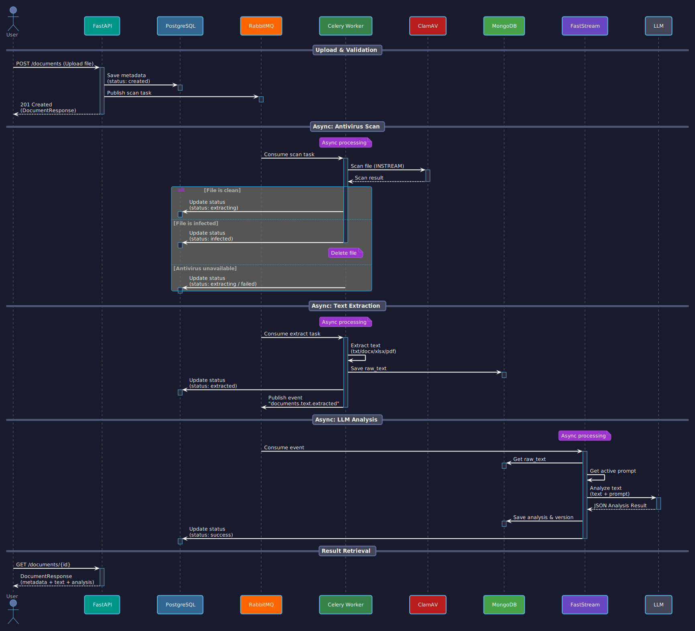

# DocMind

[](https://codecov.io/github/SadLaboka/DocMind)
[](https://sonarcloud.io/summary/new_code?id=SadLaboka_DocMind)
[](https://www.python.org/downloads/)
[](https://github.com/psf/black)
[](https://github.com/astral-sh/ruff)
[](https://mypy-lang.org/)

[](https://sonarcloud.io/summary/new_code?id=SadLaboka_DocMind)

🇷🇺 [Читать на русском](README_RU.md)

## 📋 Overview

**DocMind** is an asynchronous document analysis system using Large Language Models (LLM).
The project is built on a microservices architecture: REST API accepts files, background workers extract text from them, and a separate consumer sends it for analysis to neural networks.

The system is designed for high fault tolerance, scalability, and strict separation of responsibilities between components.


## 📑 Table of Contents

- [Features](#features)
- [Tech Stack](#tech-stack)
- [Architecture](#architecture)
- [Data Flow](#data-flow)
- [Quick Start](#quick-start)
- [Useful Commands](#useful-commands)
- [Environment Variables](#environment-variables)
- [Testing](#testing)
- [Code Quality](#code-quality)
- [Database Migrations](#database-migrations)
- [Roadmap](#roadmap)
- [Usage Examples](#usage-examples)
- [License](#license)

<a id="features"></a>
## ✨ Features

- **Asynchronous pipeline processing**: Upload, text extraction, and analysis occur in separate processes without blocking the main API.
- **Multiple format support**: Text extraction from `.txt`, `.docx`, `.xlsx`, and `.pdf` (including tables in documents).
- **Document deduplication**: The system calculates the SHA-256 hash of the file. If such a file has already been processed, re-analysis is not launched — the result is taken from the database.
- **LLM integration (Factory Pattern)**: Support for DeepSeek and Gemini. The provider is selected dynamically, and raw responses are mapped to a strict Pydantic schema.
- **Reliable task queue**: Using RabbitMQ with Dead Letter Queues (DLQ) configuration for automatic retry and handling of failed analysis tasks.
- **Caching and Rate Limiting**: API protection from overloads and optimization of database queries using Redis (user status cache, prompts, token blacklist).
- **Security**: JWT authentication (RS256) with token revocation mechanism (blacklist) and password hashing via Argon2.
- **Prompt versioning**: Ability to upload new prompt versions for LLM via admin panel with automatic caching of the active version.

<a id="tech-stack"></a>
## 🛠 Tech Stack

### Core & API
 **Python 3.13**

 **FastAPI** — REST API, Dependency Injection, Middlewares

- **Pydantic v2** — data validation and schemas
- **structlog** — structured JSON logging

### Databases & Caching
 **PostgreSQL** (SQLAlchemy + asyncpg) — user and document metadata

 **MongoDB** (Beanie) — storage of prompts, raw text, and analysis results

 **Redis** — prompt caching, user statuses, rate limiting, token blacklist

### Message Brokers & Async Tasks
 **RabbitMQ** (Kombu / aio-pika) — message broker

 **Celery** — workers for heavy text extraction from files

- **FastStream** — consumers for asynchronous text analysis via LLM

### LLM Providers
- **DeepSeek** (via OpenAI SDK)
- **Gemini** (via google-genai)

### Infrastructure & DevOps
- **Docker & Docker Compose** — orchestration of all services
- **Poetry** — dependency management
- **Alembic** — PostgreSQL migrations
- **GitHub Actions** — CI/CD, Codecov, SonarCloud
- **pytest** — coverage for API, services, and workers

<a id="architecture"></a>
## 🏗 Architecture

### Component Diagram


**Flow:**
1. Client uploads file via FastAPI
2. FastAPI publishes extraction task to RabbitMQ
3. Celery Worker extracts text and saves to MongoDB
4. Worker publishes "text extracted" event
5. FastStream consumes the event
6. FastStream retrieves raw text from MongoDB
7. FastStream sends text to LLM for analysis
8. LLM returns analysis result
9. FastStream saves analysis to MongoDB
10. FastStream updates document status in PostgreSQL

### Sequence Diagram: Document Lifecycle



<a id="data-flow"></a>
## 📊 Data Flow

### Document Processing Pipeline

1. **Upload & Validation** (FastAPI)
   - User uploads file via `POST /documents`
   - FastAPI validates file size (max 50MB), MIME type, and filename
   - File is saved to temporary storage with SHA-256 hash calculation
   - Deduplication check: if file with same hash exists, skip extraction

2. **Metadata Storage** (PostgreSQL)
   - Document metadata saved: filename, size, MIME type, hash, status
   - Status: `created` → `queued`

3. **Task Queue** (RabbitMQ)
   - FastAPI publishes extraction task to RabbitMQ
   - Task contains: document_id, temp_path, mime_type, user_id, request_id

4. **Text Extraction** (Celery Worker)
   - Worker consumes task from queue
   - Extracts text based on MIME type (TXT, DOCX, XLSX, PDF)
   - Saves raw text to MongoDB
   - Updates document status: `extracted`
   - Publishes event: `documents.text.extracted`

5. **LLM Analysis** (FastStream Consumer)
   - Consumer receives event from queue
   - Retrieves raw text from MongoDB
   - Fetches active prompt from Redis cache (or MongoDB)
   - Sends text + prompt to LLM (DeepSeek/Gemini)
   - Parses JSON response, validates structure
   - Saves analysis result to MongoDB
   - Updates document status: `success`

6. **Result Retrieval** (FastAPI)
   - User polls `GET /documents/{id}` to check status
   - Response includes: metadata, raw text, analysis result, version

### Key Architectural Decisions

**Why PostgreSQL + MongoDB + Redis?**
- **PostgreSQL**: Relational data with strict schema (users, documents metadata, transactions)
- **MongoDB**: Unstructured content (raw text, LLM analysis results, prompts) — flexible schema, large documents
- **Redis**: High-performance caching (prompts, user status), rate limiting, token blacklist

**Why Celery + FastStream?**
- **Celery**: Heavy I/O-bound tasks (text extraction from files) — proven, reliable, supports retries
- **FastStream**: Modern async consumers for LLM analysis — native async/await, better integration with async codebase

**Why local files instead of S3?**
- Current implementation uses local temp storage for simplicity
- TODO: Migrate to S3/MinIO for stateless architecture and horizontal scaling

<a id="quick-start"></a>
## 🚀 Quick Start

### Prerequisites
- **Docker & Docker Compose** (v2.0+)
- **Python 3.13** (for local development)
- **Poetry** (dependency management)
- **Make** (optional, but recommended)

### Installation & Running

1. Clone the repository:
   ```bash
   git clone https://github.com/SadLaboka/DocMind.git
   cd DocMind
   ```

2. Configure environment variables:
   ```bash
   cp .env.example .env
   # Edit .env and fill in your API keys, database credentials, etc.
   ```

3. Start all services:
   ```bash
   make up
   # Or directly: docker compose up -d --build
   ```

4. The application will be available at `http://localhost:8000`

> [!TIP]
> The first run may take 2-3 minutes as Docker builds images and applies migrations.

### API Documentation

Once running, interactive API documentation is available at:
- **Swagger UI (OpenAPI):** `http://localhost:8000/openapi`
- **ReDoc:** `http://localhost:8000/redoc`

---

<a id="useful-commands"></a>
## ⚡ Useful Commands

| Command | Description |
|---------|-------------|
| `make up` | Start all services (`docker compose up -d --build`) |
| `make down` | Stop all services and remove volumes |
| `make test` | Run tests in isolated Docker environment |
| `make cov` | Run tests with coverage report |
| `make cov-html` | Open interactive HTML coverage report |
| `make lint` | Run pre-commit hooks (ruff, black, mypy) in Docker |
| `make format` | Run ruff check + format |
| `make typecheck` | Run mypy |
| `make logs` | Follow application logs |
| `make logs-all` | Follow all service logs |

---

<a id="environment-variables"></a>
## ⚙️ Environment Variables

The full list of variables is in `.env.example`. Key variables grouped by category:

### Server
| Variable | Description | Default |
|----------|-------------|---------|
| `SERVER_HOST` | Application host | `127.0.0.1` |
| `SERVER_PORT` | Application port | `8000` |
| `SERVER_RELOAD` | Auto-reload on code changes | `true` |

### Databases
| Variable | Description | Default |
|----------|-------------|---------|
| `DB_USER` / `DB_PASSWORD` / `DB_NAME` | PostgreSQL credentials | `postgres` / `postgres` / `postgres` |
| `DB_HOST` / `DB_PORT` | PostgreSQL connection | `localhost` / `5432` |
| `MONGO_USERNAME` / `MONGO_PASSWORD` | MongoDB credentials | `root` / `example` |
| `MONGO_HOST` / `MONGO_PORT` / `MONGO_NAME` | MongoDB connection | `127.0.0.1` / `27017` / `DocMind` |
| `REDIS_HOST` / `REDIS_PORT` / `REDIS_DB` | Redis connection | `localhost` / `6379` / `0` |

### Message Broker
| Variable | Description | Default |
|----------|-------------|---------|
| `RABBITMQ_DEFAULT_USER` / `RABBITMQ_DEFAULT_PASSWORD` | RabbitMQ credentials | `guest` / `guest` |
| `RABBITMQ_HOST` / `RABBITMQ_PORT` | RabbitMQ connection | `127.0.0.1` / `15672` |

### JWT Authentication
| Variable | Description | Default |
|----------|-------------|---------|
| `JWT_ALGORITHM` | Signing algorithm | `RS256` |
| `JWT_TIMEDELTA` | Access token lifetime (minutes) | `15` |
| `JWT_REFRESH_TIMEDELTA` | Refresh token lifetime (days) | `7` |

### LLM Providers
| Variable | Description | Default |
|----------|-------------|---------|
| `LLM_DEFAULT_PROVIDER` | Default provider for analysis | `deepseek` |
| `DEEPSEEK_API_KEY` | DeepSeek API key | — |
| `DEEPSEEK_MODEL` | DeepSeek model name | `deepseek-v4-flash` |
| `GEMINI_API_KEY` | Google Gemini API key | — |
| `GEMINI_MODEL` | Gemini model name | `gemini-3.1-flash-lite` |

### Rate Limiting
| Variable | Description | Default |
|----------|-------------|---------|
| `RATE_LIMIT_GLOBAL_LIMIT` / `RATE_LIMIT_GLOBAL_WINDOW` | Global rate limit (requests / seconds) | `60` / `60` |
| `RATE_LIMIT_LOGIN_LIMIT` / `RATE_LIMIT_LOGIN_WINDOW` | Login endpoint limit | `5` / `60` |
| `RATE_LIMIT_REGISTER_LIMIT` / `RATE_LIMIT_REGISTER_WINDOW` | Register endpoint limit | `3` / `60` |
| `RATE_LIMIT_DOCUMENTS_POST_LIMIT` / `..._WINDOW` | Upload endpoint limit | `10` / `60` |
| `RATE_LIMIT_DOCUMENTS_GET_LIMIT` / `..._WINDOW` | List endpoint limit | `20` / `60` |

### Caching
| Variable | Description | Default |
|----------|-------------|---------|
| `CACHE_PROMPT_TTL` | Prompt cache TTL (seconds) | `3600` |
| `CACHE_USER_STATUS_TTL` | User status cache TTL (seconds) | `3600` |

---

<a id="testing"></a>
## 🧪 Testing

Tests run in an isolated Docker environment with a dedicated test database:

```bash
make test
```

Generate a coverage report (XML + terminal output):
```bash
make cov
# Output: ./coverage/coverage.xml
```

Open an interactive HTML coverage report:
```bash
make cov-html
```

> [!NOTE]
> The test database is automatically created and destroyed after each test run.

---

<a id="code-quality"></a>
## 🔍 Code Quality

Run linters and type checks:
```bash
make lint        # pre-commit hooks in Docker
make format      # ruff check + format
make typecheck   # mypy
```

---

<a id="database-migrations"></a>
## 🗄 Database Migrations

PostgreSQL schema is managed via **Alembic**.

Create a new migration:
```bash
make migrate-new m="add_new_field"
# Or: poetry run alembic revision --autogenerate -m "add_new_field"
```

Apply all pending migrations:
```bash
make migrate-up
# Or: poetry run alembic upgrade head
```

Rollback the last migration:
```bash
make migrate-down
# Or: poetry run alembic downgrade -1
```

> [!IMPORTANT]
> During `make up`, migrations are applied automatically via the `db-migrate` service. You only need to run these commands manually when developing locally.

---

<a id="roadmap"></a>
## 🗺 Roadmap

### Completed
- [x] Async pipeline: FastAPI + Celery + FastStream
- [x] Multi-format text extraction (TXT, DOCX, XLSX, PDF)
- [x] LLM integration with Factory Pattern (DeepSeek, Gemini)
- [x] Document deduplication by SHA-256 hash
- [x] Redis caching (prompts, user statuses, token blacklist)
- [x] Rate limiting with per-endpoint configuration
- [x] JWT authentication (RS256) with token revocation
- [x] Prompt versioning with admin panel
- [x] Dead Letter Queues for failed analysis tasks
- [x] Structured logging with `structlog` (JSON in prod)
- [x] Architecture diagrams and detailed documentation

### In Progress / Planned
- [ ] **WebSockets** — real-time document status updates (replace polling)
- [ ] **S3 / MinIO** — replace local temp storage for stateless architecture
- [ ] **Email notifications** — notify users when analysis completes
- [ ] **Telegram bot** — alternative UI on top of the existing API
- [ ] **Observability stack** — Grafana + Prometheus + Loki
- [ ] **CI/CD pipeline** — automated tests, image build, and deployment
- [ ] **Extended functionality** — document comparison, OCR for scans, custom form parsing

<a id="usage-examples"></a>
## 💡 Usage Examples

Basic workflow: register → login → upload a document → check the result.

### 1. Register a new user

```bash
curl -X POST http://localhost:8000/users/register \
  -H "Content-Type: application/json" \
  -d '{
    "login": "john_doe",
    "email": "john@example.com",
    "password": "SecurePass123!"
  }'
```

### 2. Login and get tokens

```bash
curl -X POST http://localhost:8000/auth/login \
  -H "Content-Type: application/json" \
  -d '{
    "login": "john_doe",
    "password": "SecurePass123!"
  }'
```

Response:
```json
{
  "access_token": "eyJ...",
  "refresh_token": "eyJ...",
  "token_type": "Bearer"
}
```

### 3. Upload a document for analysis

```bash
curl -X POST http://localhost:8000/documents/ \
  -H "Authorization: Bearer <access_token>" \
  -F "file=@contract.pdf" \
  -F "description=Q3 supplier contract" \
  -F "provider=deepseek"
```

> [!NOTE]
> - Supported formats: `.txt`, `.docx`, `.xlsx`, `.pdf`
> - Max file size: 50 MB
> - `provider` is optional — defaults to the value of `LLM_DEFAULT_PROVIDER`
> - If the same file was already analyzed, extraction is skipped and the existing result is reused

### 4. Get the list of your documents

```bash
curl -X GET "http://localhost:8000/documents/?page=1&limit=20" \
  -H "Authorization: Bearer <access_token>"
```

### 5. Get a specific document with analysis result

```bash
curl -X GET http://localhost:8000/documents/42 \
  -H "Authorization: Bearer <access_token>"
```

Response (once processing is complete):
```json
{
  "id": 42,
  "filename": "contract.pdf",
  "description": "Q3 supplier contract",
  "document_status": "success",
  "provider": "deepseek",
  "document_text": "Raw extracted text...",
  "analysis": {
    "summary": "Supplier contract for Q3...",
    "keywords": ["contract", "supplier", "Q3"],
    "document_type": "contract",
    "entities": {
      "organizations": ["Acme Corp"],
      "persons": ["John Doe"],
      "dates": ["2025-09-01"],
      "amounts": ["$50,000"]
    },
    "confidence": 0.92
  },
  "analysis_version": "v1.0.0",
  "created_at": "2025-01-15T10:30:00Z",
  "updated_at": "2025-01-15T10:31:45Z"
}
```

### 6. Refresh the access token

```bash
curl -X POST http://localhost:8000/auth/refresh \
  -H "Authorization: Bearer <refresh_token>"
```

### 7. Logout (revoke the token)

```bash
curl -X POST http://localhost:8000/auth/logout \
  -H "Authorization: Bearer <access_token>"
```

<a id="license"></a>
## 📄 License

This project is licensed under the **GNU Affero General Public License v3.0 (AGPL-3.0)** — see the [LICENSE](LICENSE) file for details.

The AGPL-3.0 requires that if you modify this software and run it on a network server, you must make the source code of your modified version available to the users of that server.
