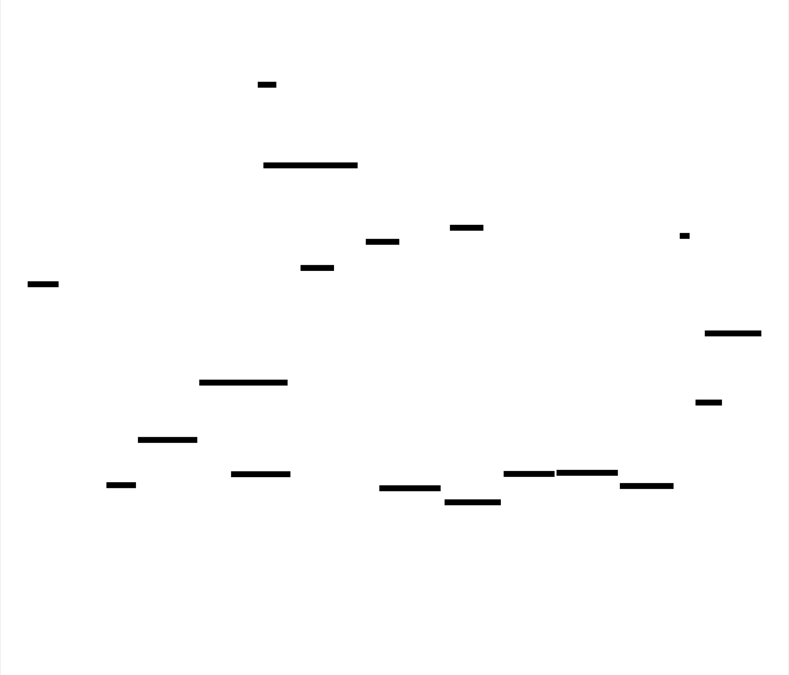
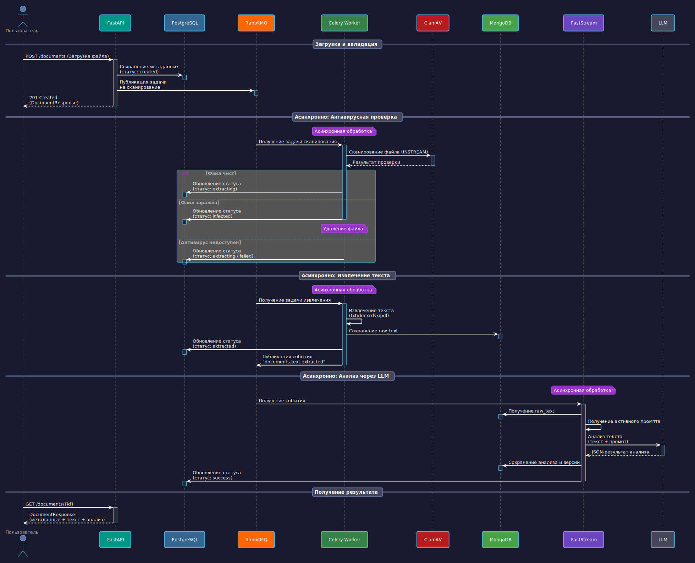

# DocMind

🇬🇧 [Read in English](README.md)

## 📋 Обзор

**DocMind** — это асинхронная система для анализа документов с использованием Large Language Models (LLM).
Проект построен по микросервисной архитектуре: REST API принимает файлы, фоновые воркеры извлекают из них текст, а отдельный консьюмер отправляет его на анализ в нейросети.

Система спроектирована для высокой отказоустойчивости, масштабируемости и строгого разделения ответственности между компонентами.

## ✨ Возможности

- **Асинхронная конвейерная обработка**: Загрузка, извлечение текста и анализ происходят в разных процессах, не блокируя основной API.
- **Поддержка множества форматов**: Извлечение текста из `.txt`, `.docx`, `.xlsx` и `.pdf` (включая таблицы в документах).
- **Дедупликация документов**: Система вычисляет SHA-256 хэш файла. Если такой файл уже обрабатывался, повторный анализ не запускается — результат берётся из базы.
- **Интеграция с LLM (Factory Pattern)**: Поддержка DeepSeek и Gemini. Провайдер выбирается динамически, а сырые ответы маппятся в строгую Pydantic-схему.
- **Надёжная очередь задач**: Использование RabbitMQ с настройкой Dead Letter Queues (DLQ) для автоматического ретрая и обработки упавших задач анализа.
- **Кэширование и Rate Limiting**: Защита API от перегрузок и оптимизация запросов к БД с помощью Redis (кэш статусов пользователей, промптов, blacklist токенов).
- **Безопасность**: JWT-аутентификация (RS256) с механизмом отзыва токенов (blacklist) и хэшированием паролей через Argon2.
- **Версионирование промптов**: Возможность загружать новые версии промптов для LLM через админ-панель с автоматическим кэшированием активной версии.

## 🛠 Технологический стек

### Core & API
 **Python 3.13**

 **FastAPI** — REST API, Dependency Injection, Middlewares

- **Pydantic v2** — валидация данных и схемы
- **structlog** — структурированное логирование в JSON

### Базы данных и кэширование
 **PostgreSQL** (SQLAlchemy + asyncpg) — метаданные пользователей и документов

 **MongoDB** (Beanie) — хранение промптов, сырого текста и результатов анализа

 **Redis** — кэширование промптов, статусов пользователей, rate limiting, token blacklist

### Брокеры сообщений и асинхронные задачи
 **RabbitMQ** (Kombu / aio-pika) — брокер очередей

 **Celery** — воркеры для тяжёлого извлечения текста из файлов

- **FastStream** — консьюмеры для асинхронного анализа текста через LLM

### LLM-провайдеры
- **DeepSeek** (через OpenAI SDK)
- **Gemini** (через google-genai)

### Инфраструктура и DevOps
- **Docker & Docker Compose** — оркестрация всех сервисов
- **Poetry** — управление зависимостями
- **Alembic** — миграции PostgreSQL
- **GitHub Actions** — CI/CD, Codecov, SonarCloud
- **pytest** — покрытие API, сервисов и воркеров

## 🏗 Архитектура

### Диаграмма компонентов

**Поток данных:**
1. Клиент загружает файл через FastAPI
2. FastAPI публикует задачу извлечения в RabbitMQ
3. Celery Worker извлекает текст и сохраняет в MongoDB
4. Worker публикует событие "текст извлечён"
5. FastStream получает событие
6. FastStream извлекает сырой текст из MongoDB
7. FastStream отправляет текст в LLM для анализа
8. LLM возвращает результат анализа
9. FastStream сохраняет анализ в MongoDB
10. FastStream обновляет статус документа в PostgreSQL

### Диаграмма последовательности: Жизненный цикл документа

## 📊 Поток данных

### Конвейер обработки документов

1. **Загрузка и валидация** (FastAPI)
   - Пользователь загружает файл через `POST /documents`
   - FastAPI валидирует размер файла (макс. 50MB), MIME-тип и имя файла
   - Файл сохраняется во временное хранилище с вычислением SHA-256 хэша
   - Проверка дедупликации: если файл с таким хэшем уже существует, извлечение пропускается

2. **Сохранение метаданных** (PostgreSQL)
   - Сохраняются метаданные документа: имя файла, размер, MIME-тип, хэш, статус
   - Статус: `created` → `queued`

3. **Очередь задач** (RabbitMQ)
   - FastAPI публикует задачу извлечения в RabbitMQ
   - Задача содержит: document_id, temp_path, mime_type, user_id, request_id

4. **Извлечение текста** (Celery Worker)
   - Воркер забирает задачу из очереди
   - Извлекает текст в зависимости от MIME-типа (TXT, DOCX, XLSX, PDF)
   - Сохраняет сырой текст в MongoDB
   - Обновляет статус документа: `extracted`
   - Публикует событие: `documents.text.extracted`

5. **Анализ через LLM** (FastStream Consumer)
   - Консьюмер получает событие из очереди
   - Извлекает сырой текст из MongoDB
   - Получает активный промпт из кэша Redis (или MongoDB)
   - Отправляет текст + промпт в LLM (DeepSeek/Gemini)
   - Парсит JSON-ответ, валидирует структуру
   - Сохраняет результат анализа в MongoDB
   - Обновляет статус документа: `success`

6. **Получение результата** (FastAPI)
   - Пользователь опрашивает `GET /documents/{id}` для проверки статуса
   - Ответ включает: метаданные, сырой текст, результат анализа, версию

### Ключевые архитектурные решения

**Почему PostgreSQL + MongoDB + Redis?**
- **PostgreSQL**: Реляционные данные со строгой схемой (пользователи, метаданные документов, транзакции)
- **MongoDB**: Неструктурированный контент (сырой текст, результаты анализа LLM, промпты) — гибкая схема, большие документы
- **Redis**: Высокопроизводительное кэширование (промпты, статусы пользователей), rate limiting, token blacklist

**Почему Celery + FastStream?**
- **Celery**: Тяжёлые I/O-задачи (извлечение текста из файлов) — проверенное, надёжное решение с поддержкой ретраев
- **FastStream**: Современные асинхронные консьюмеры для анализа через LLM — нативная поддержка async/await, лучшая интеграция с асинхронной кодовой базой

**Почему локальные файлы вместо S3?**
- Текущая реализация использует локальное временное хранилище для простоты
- TODO: Мигрировать на S3/MinIO для stateless-архитектуры и горизонтального масштабирования
